# so-exam3

**Nombre:** Daniel Perez Garcia  
**Codigo:** A00018200      
**Correo:** danielperga97@outlook.com                                                                       -
**URL repositorio:** https://github.com/Danielperga97/so-exam3

### 3 Implementar un servicio web con flask

- comenzamos por crear nuestro ambiente virtual,el cual en este caso llamaremos Parcial3, y posteriormente creamos 2 archivos que contendran las dependencias necesarias para ejecutar todo lo que realizaremos ( llamados requirements y requirements_dev). Estos archivos permitiran una instalacion rapida de las dependencias cuando ser quiera replicar el proyecto.

- luego, en un archivo llamado stats.py definiremos una clase con todos los metodos que implementaremos. En este caso los metodos que nos permitiran consultar los recursos disponible en memoria, disco y cpu. Esto junto con un archivo que llamaremos app.py, el cual contendra los metodos necesarios para la implementacion de flask, junto con los metodos que haran uso de la clase que definimos anteriormente.

-archivo stats.py   
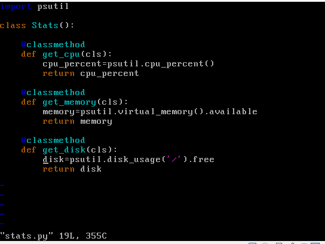

-archivo app.py       
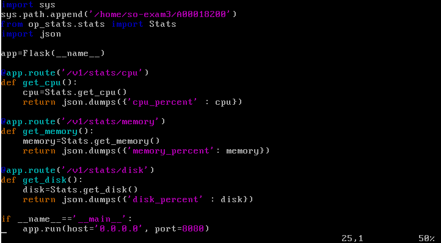

-  tras ejecutar el archivo app.py utilizaremos la extrension postman para verificar que funcione correctamente.
-captura para cpu disponible
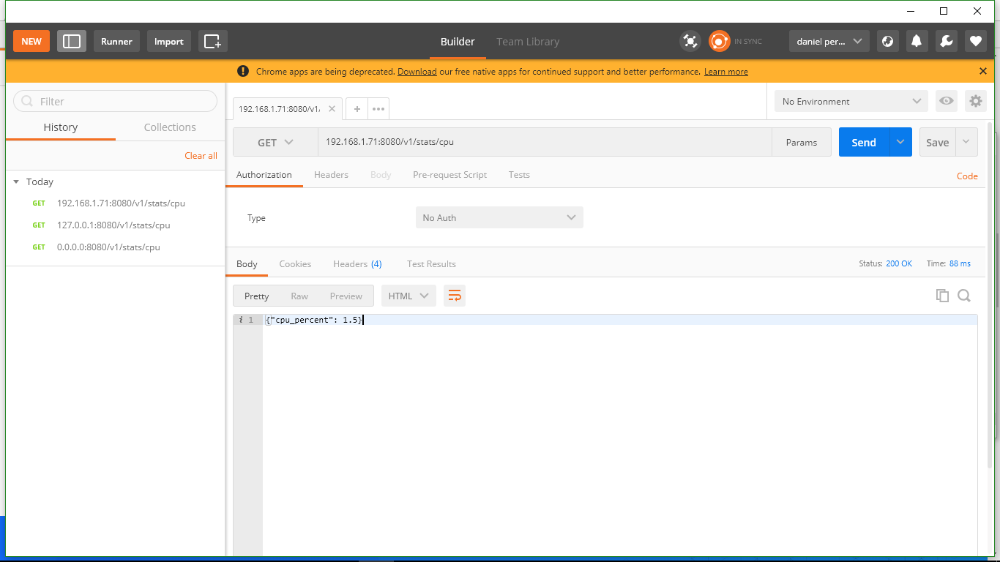

-captura para disco disponible
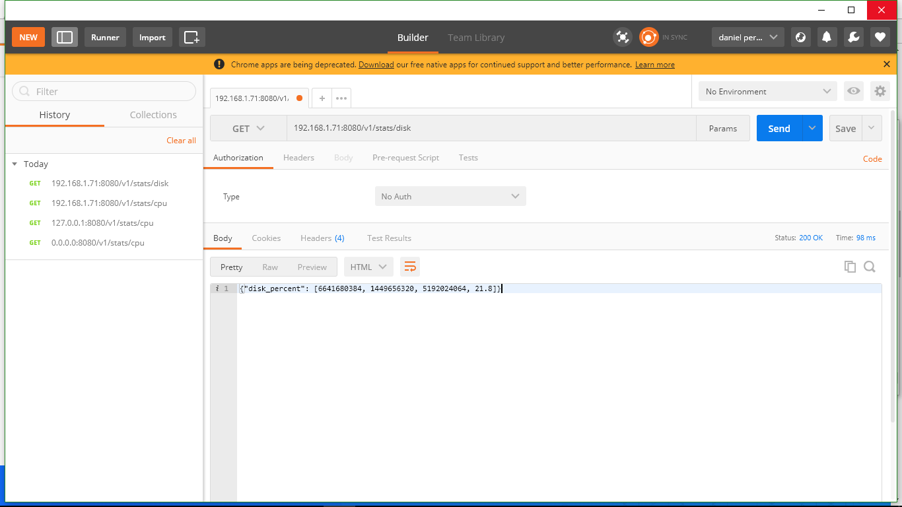

-captura memoria disponible
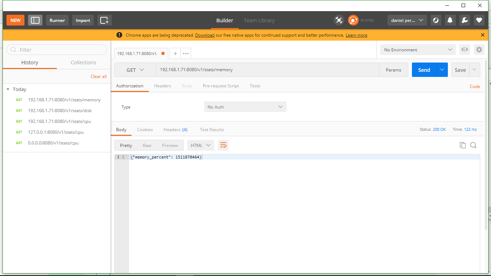

### 4 Implemente las pruebas unitarias usando fixture y mocks

- comenzamos creanod una carpeta nueva para alojar nuestras pruebas, llamada en este caso test. luego de esto definimos nuestras pruebas en un archivo que llamaremos test_stats.py, las cuales probaran el funcionamiento del servicio web. a continuacion podsemos ver su estructura:

-captura test.py 
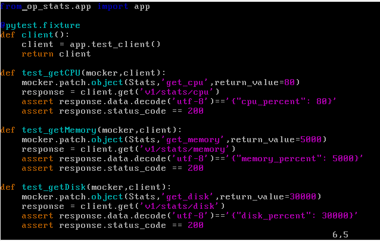

-Luego con el comando ``pytest -v``, el cual busca las pruebas disponibles en el repositorio, las ejecutamos y observamos su resultado:

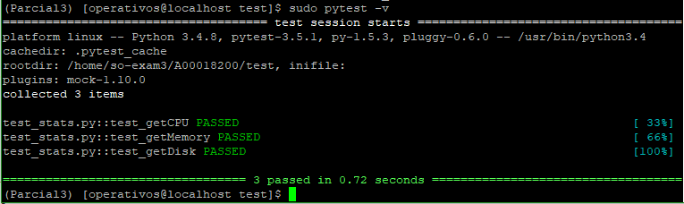

### 5 Emplee un servicio de integracíon continua que haga uso de las pruebas unitarias 

- Primero creamos el archivo tox.ini con la informacion basica del proyecto y sus entornos de prueba. en el especificamos el lenguaje a utilizar, las dependencias y librerias necesarias, y el comando que ha de ejecutar, siendo pytest en esta ocasion:

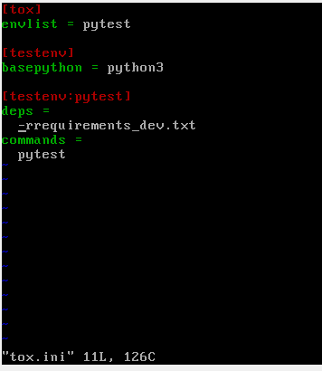

-Para ejecutar este archivo se usa el comando ``tox -e pytest``, cuyo resultado se observa a continuacion:

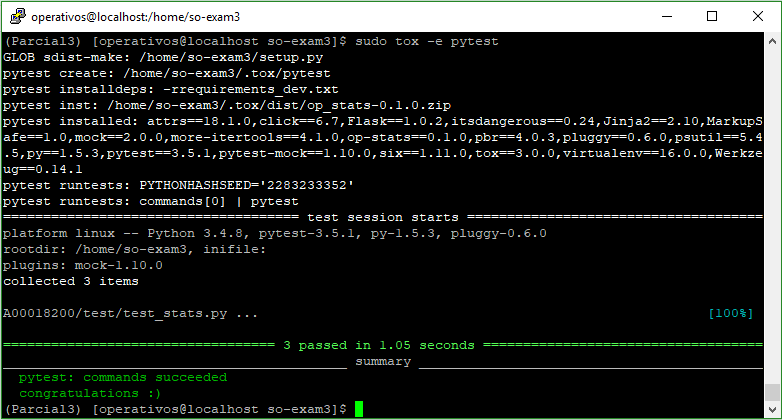

-Para finalizar, creamos un archivo .yml llamado .travis, el cual agregaremos al directorio para permitir la integracion correcta con travis ci. En este archivo se especifican caracteristicas del proyecto como el  lenguaje en el que esta escrito, su entorno y las pruebas que deseamos ejecutar, entre otras. una vez hagamo el pull request travis revisara nuestra rama y ejecutara los comandos que especifiquemos en nuestro archivo .travis.yml en busca de errores. A continuacion podemos ver esto:

-archivo .travis.yml        
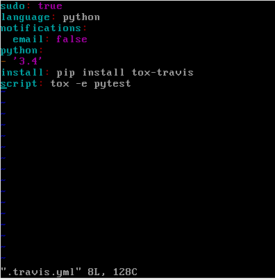

-capturas de travis en el repositorio

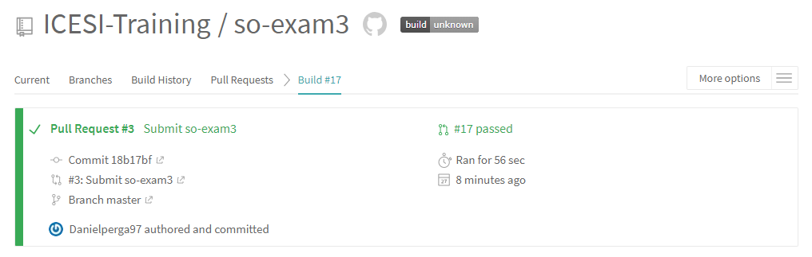
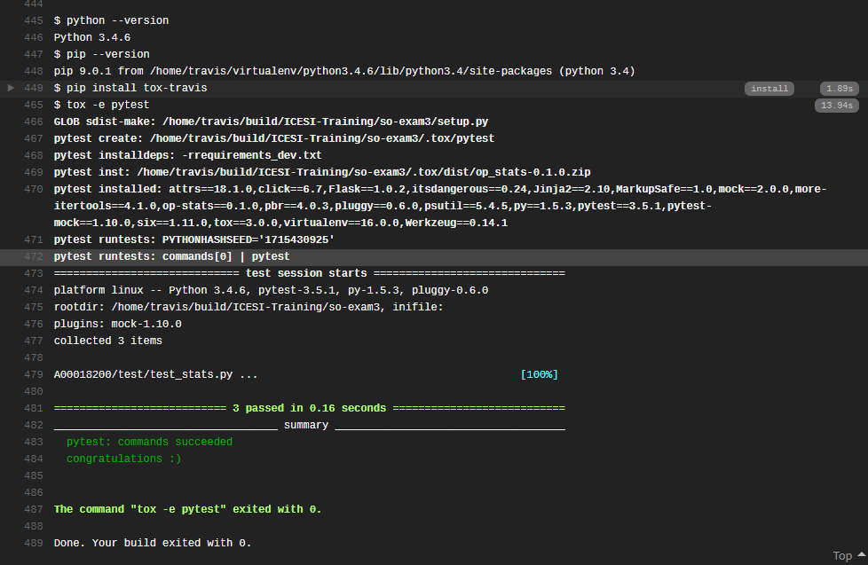
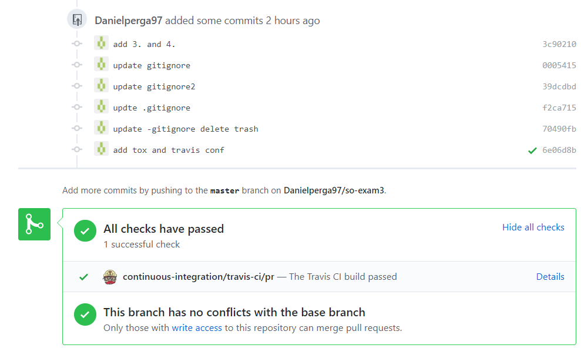

